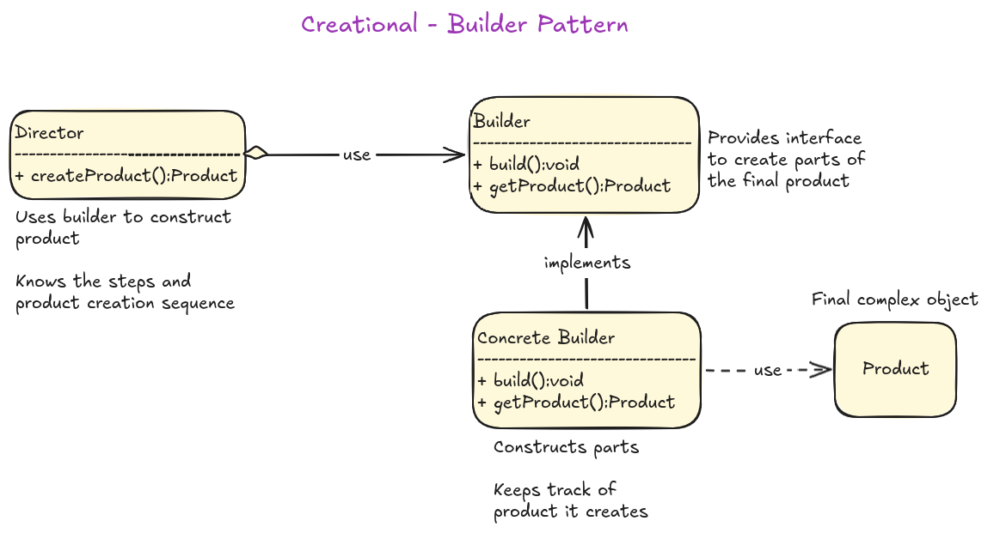
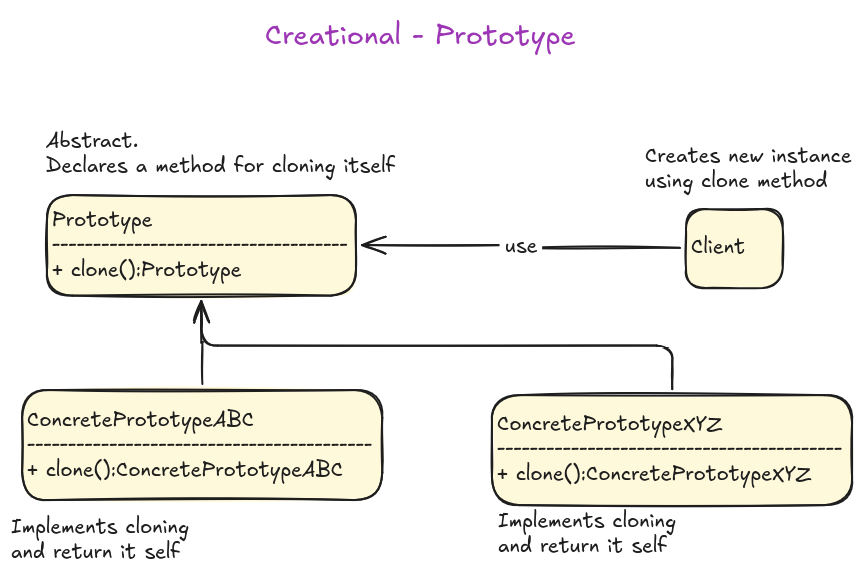
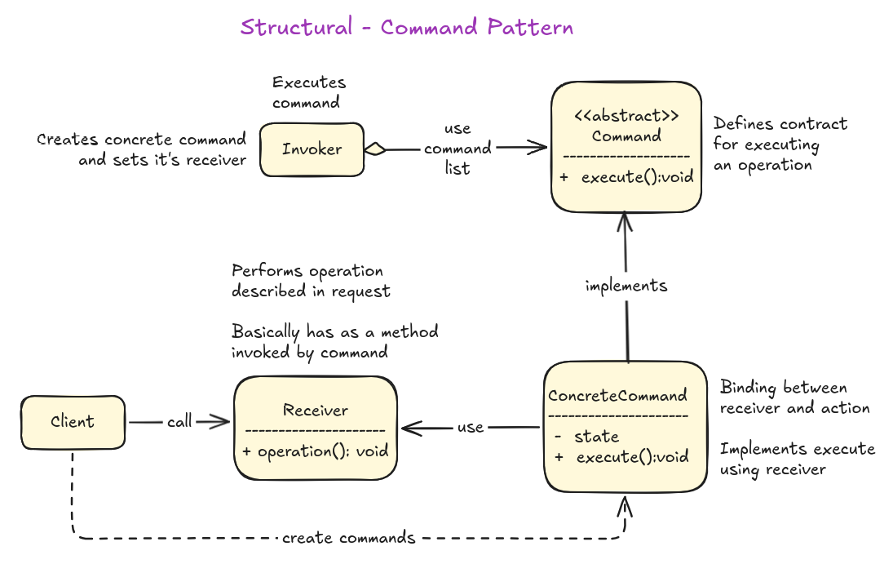
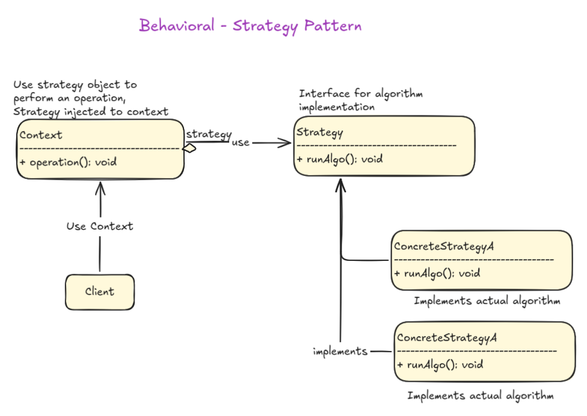
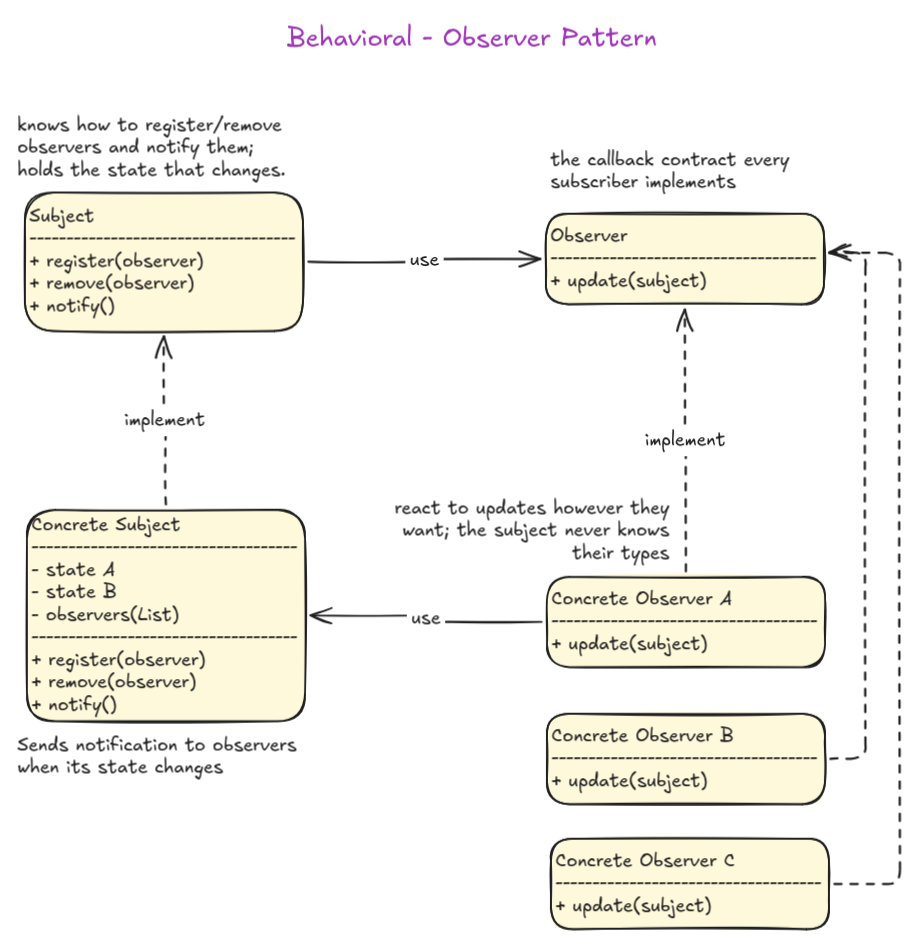

# Enterprise Patterns and Practices with Java

Bu çalışma alanında Java programlama dili ile **Enterprise Patterns and Practices** konularını ele almaya çalışıyorum. Bu konular, büyük ölçekli uygulamalar geliştirmek için kullanılan tasarım desenleri ve pratikleri içeriyor. Java dilinin temelleri, nesne yönelimli dil felsefesinin Java'da uygulanışı, gerçek hayat senaryolarında sık kullanılan tasarım desenlerinden bazıları, popüler yazılım mimarilerinde öne çıkan önemli pratikler ve Java ekosisteminde yaygın olarak kullanılan araçlar ve çerçeveler gibi konulara odaklanmayı planlıyorum. Örnek kodları Sektör Kampüste programı kapsamında hazırladığım müfredatlar içersinde de kullanabilirim.

## Platform

Çalışma ortamı olarak emektar **Ubuntu (26.04)** sistemimi seçtim.

## Kurulumlar

```bash
sudo apt update
sudo apt install default-jdk maven

# Kontrol
java -version
javac -version
mvn -version

# Vs Code tarafı için gerekli eklenti
code --install-extension vscjava.vscode-java-pack
```

**Vs Code** tarafında bir Java projesi oluşturmanın en kolay yolu `Ctrl+Shift+P` sonrası `Java: Create Java Project` komutunu kullanmak.

## İçerik

- **Fundamentals Projesi:** Bu projede Java dilinin genel özelliklerinin ele alındığı temel bilgiler yer alıyor. Hello World uygulamasında OOP'ın temel ilkelerine ve Java'nın bazı ileri seviye özelliklerine yer veriliyor.
- **SOLID Projesi:** SOLID prensiplerinin her biri için ayrı bir alt proje oluşturulmuş durumda. Her alt projede, ilgili prensibin yanlış ve doğru uygulamalarını gösteren örnekler yer alıyor. Bu örnekler prensiplerin neden önemli olduğunu ve nasıl uygulanması gerektiğini anlamaya yardımcı olacaktır.
- **Design Patterns Projesi:** Bu projede, yazılım geliştirme sürecinde sıkça karşılaşılan problemler için kullanılan tasarım desenlerinden bazıları ele alınacak. Özellikle kurumsal projelerde sık kullanılanlara dair örneklere yer vermeyi planlıyorum.
- **DDD Projesi:** Domain Driven Design (DDD) temellerinin Spring Boot kullanarak ele alındığı giriş seviyesinde bir Web API projesi. DDD'yi karmaşık bir seviyede ele almayacağız. Yani CQRS *(Command Query Responsibility Segregation)*, Event Sourcing, Message Bus gibi kavramlara bu projede girmeyeceğiz. Bunun yerine ubiquitous language, value objects, entities, aggregates, repositories, clean layering gibi kavramlara odaklanıp Java programlama dilinin nesne yönelimli özelliklerini sahada deneyimlemeye çalışacağız. Hexagonal mimari stilinde bir yapı olacak. [Detaylar için tıklayın](./src/DDD/README.md)
- **EE Projeleri:** Java Enterprise Edition örneklerinin yer aldığı projeler olabilir. Örneğin Java EE 8 veya Jakarta EE 11 ile geliştirilmiş kurumsal çözümlere yer verebiliriz. [Detaylar için tıklayın](./src/EE/README.md)

## Design Patterns

Yardımcı diagramlar.

### Creational Patterns - Builder



### Creational Patterns - Prototype



### Structural Patterns - Flyweight


### Behavioral Patterns - Command



### Behavioral Patterns - Strategy



### Behavioral Patterns - Observer



### Behavioral Patterns - Memento


## Yardımcı Kaynaklar

- [Java Programming Cheatsheet - Princeton University](https://introcs.cs.princeton.edu/java/11cheatsheet/)
- [Maven Central Repository](https://central.sonatype.com/)
- [Awesome Java](https://github.com/akullpp/awesome-java)
- [Useful Java Links](https://github.com/Vedenin/useful-java-links/)

## Ekler

Sonradan konu anlatımlarına eklenebilecek tablo veya diyagramlar için bu bölümü kullanmayı planlıyorum. Bu ekler, konuların daha iyi anlaşılmasına yardımcı olabilir.

### Hello World *(IDE yok Notepad Var)*

IntelliJ IDEA veya VS Code olmadan Notepad gibi basit bir editör ile ilk `Hello World` uygulamasını yazmak ve çıktısını görmek istediğimizde nasıl hareket ederiz? Öncellikle `Program.java` *(İstediğiniz bir ismi verebilirsiniz)* adında bir dosya oluşturur ve içine aşağıdaki kodları yazarız.

```java
import java.time.LocalDate;

public class Program {
    public static void main(String[] args) {
        System.out.println("Hello there. Today is a great day to learn Java! " + LocalDate.now());
    }
}
```

Ardından kodu **javac** ile derler ve çalıştırırız.

```bash
# derleme
javac Program.java

# ve çalıştırma
java Program

# Java 11 sonrasında gelen JEP 330(Single-File Source-Code Programs) özelliği ile
# javac ile derlemeden de doğrudan kod çalıştırılabilir.
java Program.java
```

### Aggregation vs Composition

Ne zaman hangisi?

| **Özellik**           | **Aggregation *(has-a)***                       | **Composition *(part-of)***                       |
|-------------------|----------------------------------------------|------------------------------------------------|
| Yaşam Döngüsü *(lifecycle)*| İç nesne konteyner nesneden bağımsız olarak varlığını sürdürebilir.|İç nesne konteyner nesne tarafından yönetilir ve onunla birlikte yok edilir.|
| Sahiplik *(ownership)*| Sahiplik zayıftır, iç nesne birden fazla konteyner tarafından paylaşılabilir. Örneğin bir Post nesnesi hem Section hem Tag şeklinde farklı konteynerler tarafından sahiplenilebilir.| Sahiplik güçlüdür, iç nesne yalnızca bir konteyner tarafından sahiplenilir. OrderItem nesnesi veya nesneleri sadece ilişkili olduğu Order nesnesine aittir|
| Nesne yaratımı *(creation)*| Alt nesne dışarıda yaratılır ve konteyner'a parametre ile geçilir| Alt nesne kapsayıcı nesnenin içinde yaratılır|
|Hayal et| Üniveristede bir bölüm kapansa bile öğretim görevlisi kalır| Bir bina yıkıldığında içindeki odalar da yıkılır|

## Docker Dünyası

Çalışma ortamımız Ubuntu ve sistemde virtulazation destekli bir işlemci yoksa Docker Desktop kullanamayabiliriz. Bu nedenle terminalden başımızın çağresine nasıl bakacağımızı bilmemiz gerekiyor. Aşağıdaki basit komutlar işimizi görecektir.

Temel işlemlerle başlayalım.

```bash
# Çalışmakta olan konteynerleri listele
docker ps

# Tüm konteynerleri listele
# Özellikle durmuş, hata almış konteynerleri görmek için kullanışlıdır.
docker ps -a

# docker-compose ile konteynerleri ayağa kaldırmak için
docker-compose up -d

# docker-compose ile çalıştırılan servisleri durdurmak ve bağlı olan ağları silmek içinse
docker-compose down

# Çalışan konteynerin içerisine terminal bağlantısı açmamız gerekirse
# Bazı imajlarda bash yerine sh yazmak gerekebilir.
# Çıkmak içinse giriş yapılan terminalden Ctrl+D veya exit komutu kullanılabilir.
docker exec -it <container_name> /bin/bash
```

Başımız sıkışırsa kullanabileceğimiz bazı komutlar:

```bash
# Loglara bakmak istersek
# -f parametresi logların canlı olarak akmasını sağlar. Çıkmak için Ctrl+C kullanılabilir.
docker logs -f <container_name>

# Tüm servis loglarını görmek istersek
docker-compose logs -f

# Konteynerin IP adresi, bağlı olduğu volume bilgileri, ortam değişkenleri gibi detaylı bilgileri görmek istersek
docker inspect <container_name>

# Host makine ile konteyner arsaındaki port eşleşmesini görmek istersek
docker port <container_name>

# Konteynerlerin sistem kaynaklarını ne kadar kullandığını görmek istersek
docker stats

# docker' ın sistemde ne kadar yer kapladığını görmek istersek
docker system df
```

Ara sıra mutfağı temizlemek gerekir. Zira kullanılmayan imajlar, durdurulmuş konteynerler diski fazlasıyla şişirebilir. Bu nedenle aşağıdaki komutları kullanabiliriz.

```bash
# Güvenli temizlik için 
docker system prune

# Ama elimizde nükleer bir güç de var :D
# Sadece o an çalışanlar hariç kullanılmayan tüm imajları, ağları ve veritabanı verileri dahil tüm volume'ları siler
docker system prune -a --volumes

# Belli bir imajı silmek istersek
docker rmi <image_name>

# Tabii ortada çalışan bir konteyner varsa imajı silemezsiniz. O zaman önce konteyneri durdurup silmeniz gerekir. Sonrasında imajı silebiliriz.
docker stop <container_name>
docker rm <container_name>

# Sistemdeki tüm veri birimlerini listelemek istersek
docker volume ls

# Sistemdeki tüm Docker ağlarını listelemek istersek
docker network ls
```
