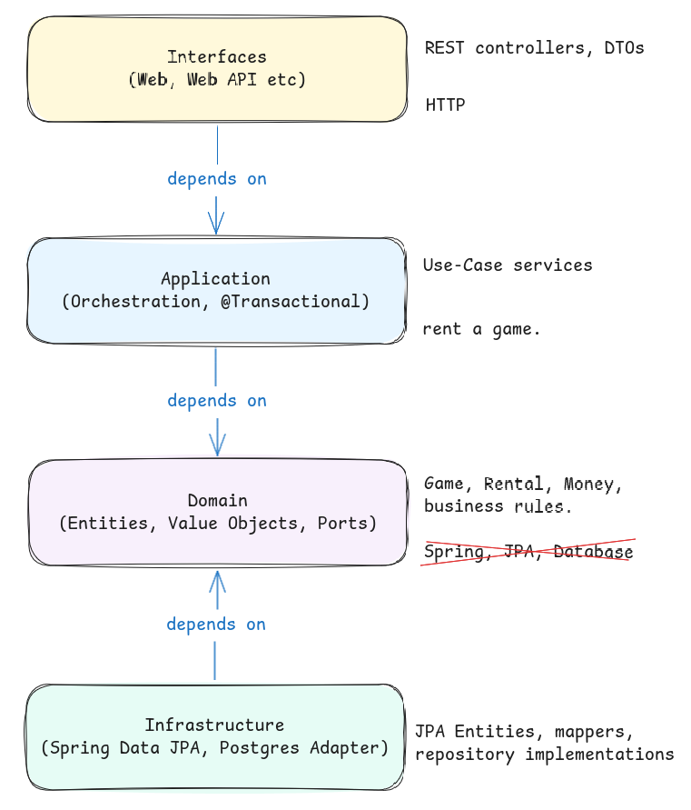
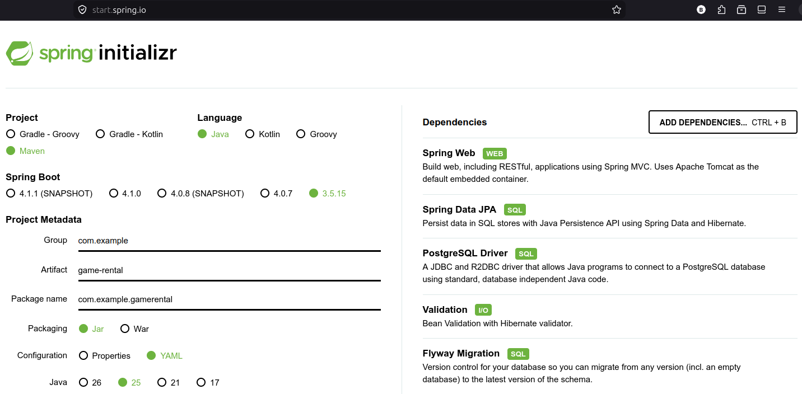
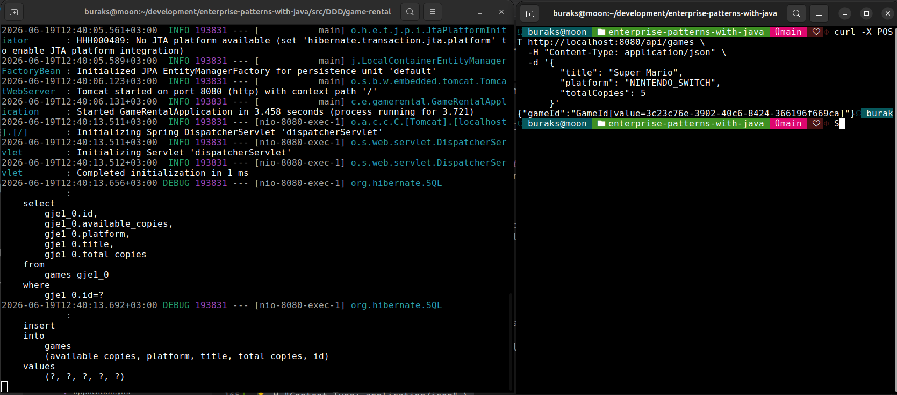
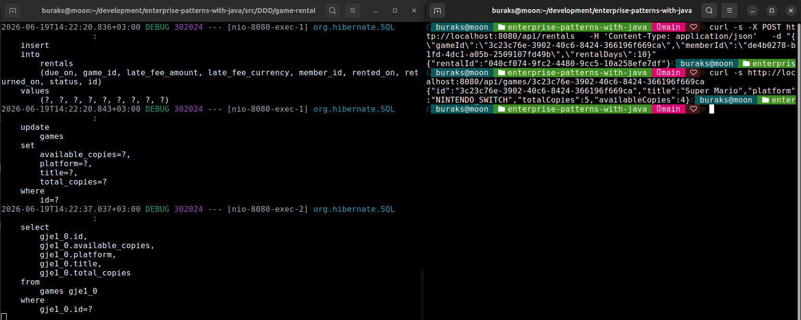
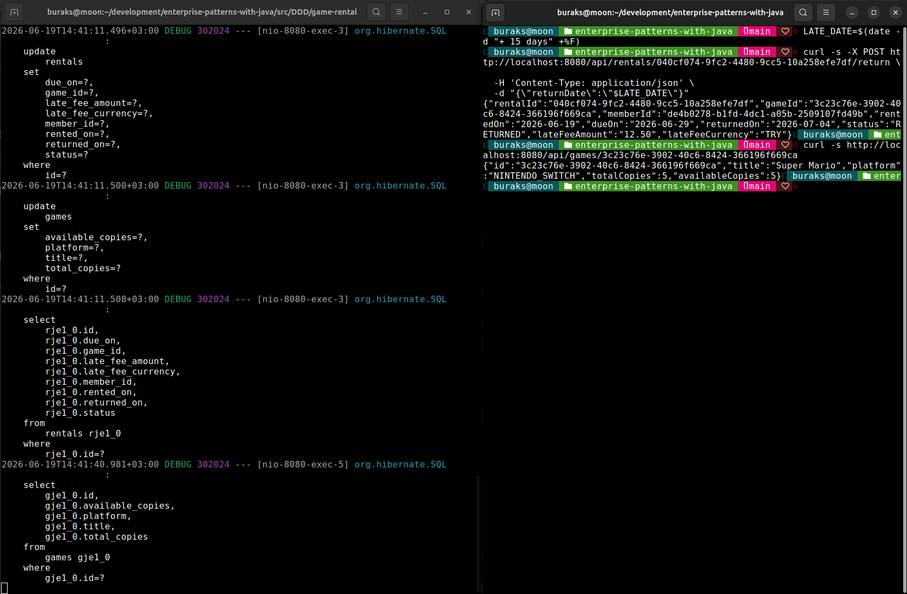
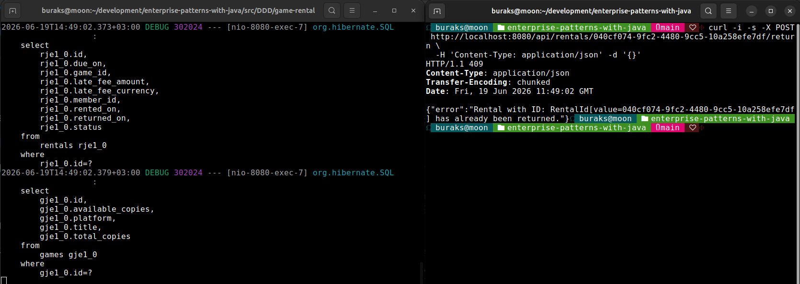

# Spring Boot ile Basit bir DDD Projesi

Domain Driven Design (DDD) temellerinin Spring Boot kullanarak ele alındığı giriş seviyesinde bir Web API projesi. DDD'yi karmaşık bir seviyede ele almayacağız. Yani CQRS *(Command Query Responsibility Segregation)*, Event Sourcing, Message Bus gibi kavramlara bu projede girmeyeceğiz. BUnun yerine ubiquitous language, value objects, entities, aggregates, repositories, clean layering gibi kavramlara odaklanıp Java programlama dilinin nesne yönelimli özelliklerini sahada deneyimlemeye çalışacağız.

## Senaryo

Bilgisayar oyunu kiralayabildiğimiz bir sistemin backend tarafını geliştireceğiz. En basit haliyle Ubiquitous Language'ı tanımlayarak başlayalım:

- Oyuunlar kataloğumuzda birer isim *(Pacman, Super Mario,...)* gibi. Mağazamızda oyun kutularından n adet olabilir.
- Abonelerimiz var. Bu demoda aboneleri sadece bir ID olarak tanımlayacağız.
- Abonelerimiz oyun kiralayabilirler. Kiralanan oyunlar belli bir sürede geri getirilir yani kiralama süreleri vardır.
- Abone kiraladığı oyunu geri getirdiğinde kiralama sona erer ve oyun tekrar mağazada kiralanabilir hale gelir. Ama gecikme olursa bu gecikme süresi kadar ekstra ücret ödenir. Örneğin gecikilen gün başına 1 TL gibi.

İş kuralarımız ile bazı şeyleri güvence altına alalım:

- Mağaza stoğunda olmayan bir oyun kiralanamaz.
- Oyun kiralandığında kullanılabilir oyun sayısı 1 azalır, geri getirildiğinde 1 artar.
- Bir kiralama iki kez geri getirilemez.
- Gecikme ücreti için şu formül geçerlidir: `gecikme ücreti = gecikilen gün sayısı * 1 TL`

Buradaki basit iş kuralları Domain model içerisinde yaşayacak ve asla atlanamayacaktır *(No Bypass)*. Bu sayede iş kurallarımızın her zaman geçerli olduğunu garanti altına alacağız.

## DDD Özeti

DDD daha çok iş modelini kodun tam merkezine yerleştirme yaklaşımıdır. Bu sayede iş kuralları ve mantığı, uygulamanın her yerinde tutarlı bir şekilde uygulanabilir. Ayrıca framework, veritabanı gibi altyapı detaylarını dışarıda tutarak, iş modelinin bağımsız ve test edilebilir olmasını sağlar. Bu örnek özelinde ele alacağımız kavramları aşağıdaki tablo ile özetleyebiliriz...

| **Kavram** | **Ne anlama gelir?** | **Bizim örneğimizde neye karşılık gelir?** |
| --- | --- | --- |
| **Ubiquitous Language** | Tüm ekip *(Geliştiriciler, İş Analistleri, Test Uzmanları, vb.)* tarafından paylaşılan ortak dil. | Game, Rental, lateFee, returnOn vb |
| **Value Object** | Kimliği olmayan, sadece değerleriyle tanımlanan nesneler. Değiştirilemezdirler. *(Immutable)* | Money, GameId gibi |
| **Entity** | Kimliği olan, yaşam döngüsü boyunca değişebilen nesneler. | Game, Rental gibi |
| **Aggregate** | Birbirleriyle ilişkili Entity ve Value Object'lerin bir araya gelerek oluşturduğu tutarlı bir bütün. | RentalAggregate, GameAggregate gibi |
| **Aggregate Root** | Aggregate'in dış dünya ile olan tek giriş noktasıdır. | RentalAggregate'in root'u Rental, GameAggregate'in root'u Game gibi |
| **Repository** | Aggregate'lerin saklanması ve erişilmesi için kullanılan koleksiyon benzeri aggregate yapıları. | RentalRepository, GameRepository gibi |
| **Domain Service** | Birden fazla Entity veya Value Object'in etkileşimde bulunduğu karmaşık iş mantığını içeren servisler. | Bu örnekte ele almayacağız |
| **Application Service** | Bir transaction *(Use Case)* orkestrasyonunu yöneten servis. | RentGameService |

## Proje Mimarisi

Projede oldukça yalın katmanlı *(layered)* mimari kullanacağız. Yapıyı hexagonal mimari türünde inşa edeceğiz. Burada altın kural bağımlılıkların yönünün *(Dependency Direction)* doğru uygulanması. Örneğin domain paketi sıfır framework bağımlılığına sahip olmalı ki domain modelindeki iş kurallarını çok kısa sürelerde hiçbir dış framework bağımlılığı olmadan test edebilelim. Bu sayede domain modelimizi daha esnek ve sürdürülebilir hale getireceğiz. Mimari kurguyu kabaca aşağıdaki şekilde olduğu gibi özetleyebiliriz.



## Proje İskeletinin Oluşturulması

Spring Boot proje oluşturma aracı olan [Spring Initializr](https://start.spring.io/) adresini kullanarak projemizi oluşturabiliriz. İster web sitesinden ister **curl** komutu ile oluşturabiliriz.



Özellikle kendi sistemimizde hangi Java ve Maven versiyonları olduğuna dikkat etmekte yarar var. Aynı işlemi terminal üzerinden de yapabiliriz.

```bash
curl https://start.spring.io/starter.zip \
  -d type=maven-project \
  -d language=java \
  -d bootVersion=3.5.15 \
  -d javaVersion=25 \
  -d groupId=com.example \
  -d artifactId=game-rental \
  -d name=game-rental \
  -d packageName=com.example.gamerental \
  -d dependencies=web,data-jpa,postgresql,validation,flyway \
  -o game-rental.zip

unzip game-rental.zip -d game-rental
cd game-rental
```

Dikkat edileceği üzere proje oluşturulurken bazı bağımlılıklar eklenmiş durumda *(dependencies)*. Bunları şöyle özetleyebiliriz.

| **Bağımlılık** | **Ne işe yarar?** |
| --- | --- |
| **Spring Web** | REST API geliştirmek için gerekli olan Spring MVC altyapısını sağlar. Tomcat gibi gömülü bir web sunucusu içerir. |
| **Spring Data JPA** | ORM *(Object-Relational Mapping)* işlemleri için gerekli altyapıyı sağlar. JPA standartlarını kullanarak veritabanı işlemlerini kolaylaştırır. |
| **PostgreSQL Driver** | PostgreSQL veritabanına bağlanmak için gerekli sürücüyü sağlar. |
| **Spring Validation** | Bean Validation API'sini kullanarak veri doğrulama işlemlerini kolaylaştırır. |
| **Flyway** | Veritabanı şemasını yönetmek ve sürüm kontrolü sağlamak için kullanılan bir araçtır. Migrations işlemlerini kolaylaştırır. |

Örnekte postgresql veritabanı kullanılmakta olup **docker-compose** ile ayağa kaldırılmaktadır.

```bash
sudo docker-compose up -d
```

## Proje Oluşturulduktan Sonra Bazı Ayarlamalar

Proje oluşturulduktan sonra postgresql desteği için yeni bir flyway bağımlılığı *(dependency)* eklememiz gerekebilir. Bunun için tüm proje ayarlarını içeren `pom.xml` dosyasına aşağıdaki bağımlılığı eklemek yeterli olacaktır.

```xml
<dependency>
    <groupId>org.flywaydb</groupId>
    <artifactId>flyway-database-postgresql</artifactId>
</dependency>
```

Eğer projeyi komut satırından oluşturduysak konfigurasyon dosyası *(application.properties)* YAML formatında oluşmamış olabilir. Bu dosyayı silip `application.yml` isimli yeni bir dosya oluşturup içeriğini aşağıdaki şekilde düzenleyebiliriz. *(Dosya `src/main/resources` dizininde olmalıdır.)*

```yaml
spring:
  datasource:
    url: jdbc:postgresql://localhost:5432/gamerental
    username: gamerental
    password: secret

  jpa:
    hibernate:
      ddl-auto: validate
    open-in-view: false
    properties:
      hibernate:
        format_sql: true

  flyway:
    enabled: true

logging:
  level:
    org.hibernate.SQL: debug
```

## Migration Hazırlıkları

Migration işlemleri için `src/main/resources/db/migration` klasöründe `V1__init.sql` isimli bir dosya oluşturacağız. Projemiz için aşağıdaki içeriği kullanabiliriz.

```sql
CREATE TABLE games (
    id               UUID         PRIMARY KEY,
    title            VARCHAR(100) NOT NULL,
    platform         VARCHAR(50)  NOT NULL,
    total_copies     INT          NOT NULL,
    available_copies INT          NOT NULL
);

CREATE TABLE rentals (
    id                 UUID          PRIMARY KEY,
    game_id            UUID          NOT NULL,
    member_id          UUID          NOT NULL,
    rented_on          DATE          NOT NULL,
    due_on             DATE          NOT NULL,
    returned_on        DATE,
    status             VARCHAR(20)   NOT NULL,
    late_fee_amount    NUMERIC(10,2) NOT NULL,
    late_fee_currency  VARCHAR(3)    NOT NULL
);

CREATE INDEX idx_rentals_game_id ON rentals (game_id);
```

DDD tasarımında her aggregate kendi tutarlı bütünlüğünü korumakla sorumludur. Ayrıca, aggregate diğer aggregate'ere ID ile referans verir. Bu nedenle herhangi bir **foreign key constraint** kullanmayacağız. Bu sayede aggregate'ler birbirlerinden bağımsız olacak ve aggregate root'lar kendi aggregate'lerini yönetebilecekler. Zaten **foreign key constraint* kullandığımızda aggregate'ler DB seviyesinde birbirlerinin yaşam döngüsüne bağımlı hale gelirler ve bu DDD tasarımına aykırıdır.

## Çalışma Zamanı

Uygulama kodları tamamlandıktan sonra aşağıdaki **maven** komutu ile çalıştırabiliriz. Tabii **postgresql** konteynerinin çalışır durumda olduğundan emin olalım. Komutu projenin kök dizininde işletebiliriz.

```bash
./mvnw spring-boot:run
```

Başlangıçta `V1__init.sql` dosyasındaki SQL scriptleri çalışacak ve veritabanında gerekli tablolar oluşturulacaktır. Daha sonra API endpoint'lerine istekler atarak uygulamanın çalıştığını doğrulayabiliriz.

Efsane oyunlardan Super Mario'yu kataloğumuza ekleyelim.

```bash
curl -X POST http://localhost:8080/api/games \
  -H "Content-Type: application/json" \
  -d '{
        "title": "Super Mario",
        "platform": "NINTENDO_SWITCH",
        "totalCopies": 5
      }'
```



ve şimdi de bir oyun kiralayalım. Tabii şimdilik tam bir abonelik sistemimiz olmadığı için abone ID bilgisini kendimiz veriyoruz. Game ID değeri içinse bir önceki denemede eklediğimiz ID değerini kullanabiliriz.

```bash
curl -s -X POST http://localhost:8080/api/rentals \
  -H 'Content-Type: application/json' \
  -d "{\"gameId\":\"3c23c76e-3902-40c6-8424-366196f669ca\",\"memberId\":\"de4b0278-b1fd-4dc1-a05b-2509107fd49b\",\"rentalDays\":10}"
```

Tabii bunun üzerine kullanbilecek oyun kopya sayısını da kontrol edebiliriz.

```bash
curl -s http://localhost:8080/api/games/3c23c76e-3902-40c6-8424-366196f669ca
```



Şimdi abonemizin oyunu çok sevdiğini ve birkaç gün geç iade ettiğini düşünelim. Bunu simüle etmek için aşağıdaki gibi ilerleyebiriz.

```bash
# Önce iade tarihini bugünden 15 sonraya ayarlayalım ki gecikme ücreti oluşsun.
LATE_DATE=$(date -d "+ 15 days" +%F)

# Bu çağrı sonrasında bir gecikme ücreti oluşmasını bekliyoruz.
curl -s -X POST http://localhost:8080/api/rentals/040cf074-9fc2-4480-9cc5-10a258efe7df/return \
  -H 'Content-Type: application/json' \
  -d "{\"returnDate\":\"$LATE_DATE\"}"

# Son olarak oyun bilgilerini tekrar kontrol edelim. Kiralama sona erdiği için kullanılabilir oyun sayısının tekrar 5 olduğunu görmemiz lazım.
curl -s http://localhost:8080/api/games/3c23c76e-3902-40c6-8424-366196f669ca
```



Son olarak birde dükkana geri dönen bir oyunu tekrar döndürmek istediğimiz almamız gereken Conflict hatasına bakalım.

```bash
curl -i -s -X POST http://localhost:8080/api/rentals/040cf074-9fc2-4480-9cc5-10a258efe7df/return \
  -H 'Content-Type: application/json' -d '{}'
```


