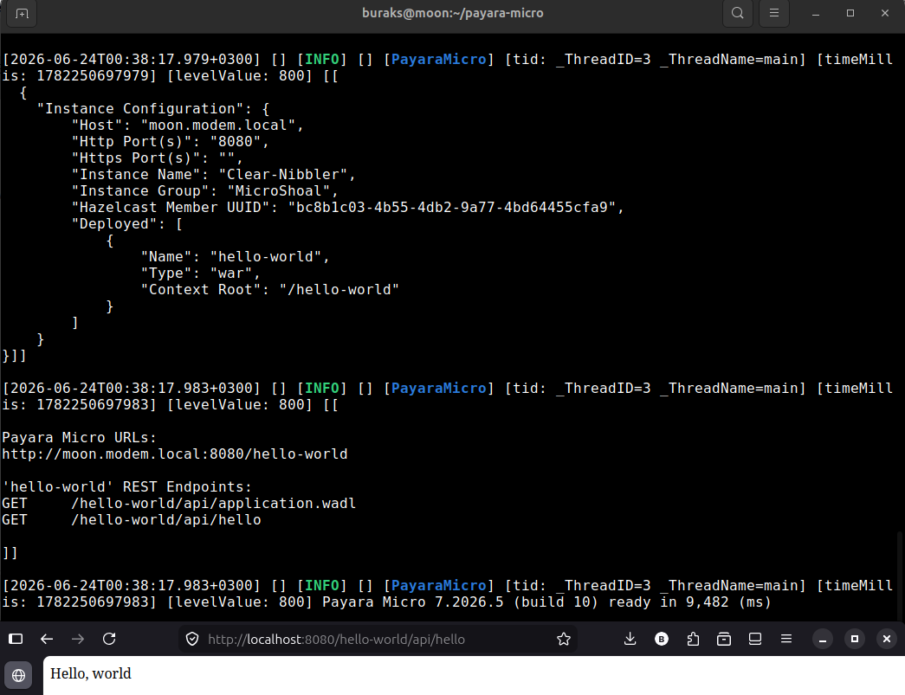

# Kurumsal Çözümler (Enterprise Solutions) için Java

Kurumsal projeleri düşündüğümüzde hepsinin belli başlı temel ve aynı zamanda ortak ihtiyaçları olduğunu görürüz. Veri saklama *(Persistence)*, güvenlik *(Security)*, web servisleri *(Web Services)*, transaction yönetimi, gevşek bağlı yapılar *(Loose Coupling)* vb Bu değişmeyen ihtiyaçlarda soyutlamaların *(Abstraction)* standartlaştırılması da önemlidir. Asıl implementasyon detayları bu soyutlamaların üzerinde şekillenir. Ana prensip olarak Java Enterprise Edition (Java EE) veya Jakarta EE gibi çatılar bu soyutlamaları standartlaştırmak için ortaya çıkmıştır.

Bu noktada bazı temel kavramları bilmekte yarar var.

## Application Server

Örneğin uygulama sunucları *(Application Server)* kurumsal çözümlerin önemli bir parçasıdır. Loglama, hata yönetimi, REST uç noktaları, JSON standartları, CDI *(Contexts and Dependency Injection)*, JPA *(Java Persistence API)*, JMS *(Java Message Service)*, EJB *(Enterprise Java Beans)* gibi kurumsal çözümlerde sıkça ihtiyaç duyulan soyutlamaları standartlaştırırlar. Bu sayede geliştiriciler uygulama sunucusunun sağladığı standartları kullanarak iş mantığını geliştirmeye odaklanabilirler. Bazı popüler uygulama sunucuları şunlardır:

- [IBM Open Liberty](https://openliberty.io/)
- [Payara Server *(Glassfish)*](https://www.payara.fish/)
- [JBOSS Wildfly](https://www.wildfly.org/)

Bu sunucular bir nevi Java EE spesifikasyonlarının asıl implementasyonları *(Concrete Implementations)* olarak düşünülebilir. Örneğin Jakarta EE 11 spesifikasyonları için Open Liberty, Payara Server ve Wildfly gibi uygulama sunucuları asıl implementasyonları sağlarlar.

## JSR *(Java Specification Request)*

JSR, Java topluluğu tarafından önerilen ve Java platformuna eklenmesi düşünülen yeni özellikleri veya mevcut özelliklerde yapılacak değişiklikleri tanımlayan bir belgedir. Her JSR, belirli bir Java teknolojisi veya API için bir spesifikasyon sunar ve bu spesifikasyonlar, uygulama sunucuları tarafından implemente edilir. Örneğin [CDI 1.0 için JSR-299](https://jcp.org/ja/jsr/detail?id=299), [JPA 2.0 için JSR-317](https://jcp.org/ja/jsr/detail?id=317) gibi

## Reference Implementation *(RI)*

Özet JSR'ların *(Abstract Specifications)* asıl implementasyonlarıdır. Örneğin JAX-RS için referans implementasyon olarak [Jersey](https://eclipse-ee4j.github.io/jersey/) kullanılabilir. Hatta Java EE'ın kendisi aslında bir JSR *(Java Specification Request)* olarak düşünülebilir. Java EE 8 sürümü [JSR 366](https://jcp.org/en/jsr/detail?id=366) olarak tanımlanmıştır ve Glassfish bu JSR'ın örnek bir implementasyonudur *(RI - Reference Implementation)*.

## Jakarta EE

[Jakarta EE](https://jakarta.ee/) Java EE'ın evrimleşmiş bir versiyonu olarak düşünülebilir. Oracle'ın Java EE'yi Eclipse Foundation'a devretmesiyle birlikte, Java EE artık Jakarta EE olarak adlandırılmaktadır. Jakarta EE, Java EE'ın tüm özelliklerini ve API'lerini içerir, ancak isimlendirme ve bazı paket değişiklikleri ile güncellenmiştir. Örneğin, `javax.*` paketleri artık `jakarta.*` olarak değişmiştir.

Java ekosisteminin en önemli özelliklerinden birisi standartlar *(specifications)* ve implementasyonların *(implementations)* birbirinden kesin çizgilerle ayrılmasıdır. Alışkın olduğumuz mimarilerde genellikle ilkeleri belirleyen ve işi yapan aynı framework altında toplanır. Jakart ise sadece kuralları ve arayüzleri belirler, iş topluluk tarafından geliştirilen motorların üstünden yürütülür. Burada karşımıza üç ana bileşenin çıktığını görürüz. CDI *(Contexts and Dependency Injection)*, JPA *(Java Persistence API)* ve JAX-RS *(Java API for RESTful Web Services)*.

### CDI *(Contexts and Dependency Injection)*

Uygulamanın sinir sistemi olarak ifade edildiği sıklıkla görülür. Nesnelerin yaşam döngülerini ve birbirlerine olan bağımlılıklarını yönetir. Sonradan .NET tarafına gelen Microsoft.Extensions.DependencyInjection kütüphanesi olarak düşünebiliriz ya da Autofac, Ninject gibi dependency injection kütüphanelerine benzetebiliriz. Diğer yandan bunu basit bir DI aracı olarak görmemek lazım. Kendi için olay yönetimi (Event/Observer) sunar. Ayrıca interceptor yapısı ile metodan girmeden önce veya çıktıktan sonra araya girip AOP *(Aspect Oriented Programming)* tarzı davranışlar sergileyebilir. Örneğin bir metodun girişinde loglama yapmak, yetkilendirme kontrolü icra ettirmek otomatik transaction işletmek gibi.

### JPA *(Java Persistence API)*

Uygulamanın hafızası olarak düşünebiliriz. Temelde bir arayüz ve anotasyonlar kümesidir. `@Entity`, `@Table`, `@Column` gibi anotasyonlar ile nesneleri veritabanı tablolarına eşler. Kendi başına sorgu atmaz. Bunun için JPA implementasyonları vardır. Örneğin Hibernate, EclipseLink, OpenJPA gibi. Bu implementasyonlar JPA'nın sağladığı arayüzleri kullanarak veritabanı ile iletişim kurar ve sorguları işler. Kavramsal olarak .NET tarafındaki Entity Framework veya Dapper gibi ORM *(Object-Relational Mapping)* kütüphanelerine benzetebiliriz. Hatta DbContext ve DbSet ile kurulan yap burada EntityManager üzerinden yürütülür.

### JAX-RS *(Java API for RESTful Web Services)*

Uygulamanın dış dünyaya açılan kapısı olarak düşünebiliriz. RESTful web servisleri oluşturmak için standart bir API sunar. `@Path`, `@GET`, `@POST`, `@PUT`, `@DELETE` gibi anotasyonlar ile HTTP isteklerini işleyen metodları tanımlar. .NET tarafındaki Route, HttGet gibi nitelikler burada `@Path`, `@Get` gibi anotasyonlarla karşılık bulur.

> Bu üç standard düzgün bir şekilde bir araya getirildiğinde uygulama sunucusundan bağımsız, taşınabilir ve tertemiz bir mimari elde etmiş oluruz.

## Alet Çantası

Nelere ihtiyacımız var?

- JDK *(Java Development Kit)*
- [NetBeans IDE](https://netbeans.apache.org/front/main/index.html), [Eclipse IDE](https://www.eclipse.org/downloads/) veya [Visual Studio Code](https://code.visualstudio.com/) gibi kod geliştirme aracı.
- [Insomnia](https://insomnia.rest/) veya [Postman](https://www.postman.com/) gibi REST API test araçları.
- [Apache Maven](https://maven.apache.org/) veya [Gradle](https://gradle.org/) gibi proje yönetim ve derleme araçları.
- [Payara Micro Server](https://payara.fish/products/payara-micro/) Micro service suncusu olarak kullanabiliriz. Hafifsiklet bir web sunucusu olarak düşünebiliriz.

Kendi Ubuntu sistemimde `Insomnia` kurulumunda sorun çıktı. Aşağıdaki şekilde kurabildim.

```bash
wget --content-disposition https://updates.insomnia.rest/downloads/ubuntu/latest
sudo apt install ./Insomnia*.deb
```

Benzer şekilde `Payara Micro` sunucusunu çalıştırırken de IPv6 ile ilgili bir hata aldım. Burada IPv4 kullanmak için aşağıdaki komutu kullanabilirsiniz.

```bash
# Payara Micro 7.2026.5.jar içeriğini indirdiğim klasörde çalıştırıyorum.
java -Djava.net.preferIPv4Stack=true -jar payara-micro-7.2026.5.jar
# Sonrasında 8080 portu üzerinden sunucuya erişebilirsiniz.
```

## Hello World Uygulaması

Macera Jakarta öncesi dönemden EE 8 uyumlu bir proje ile başlıyor. Bu projeyi oluşturmak için NetBeans IDE kullanabiliriz. NetBeans IDE'yi açtıktan sonra aşağıdaki adımları takip edebiliriz.

- Adım 1 Proje seçimi: File -> New Project -> Java with Maven -> Project from Archetype -> Next
- Adım 2 Archetype seçimi: `jakarta.jakartaee-api` seçimi -> Next
- Adım 3 Proje bilgileri: Project Name : `hello-world`, Group Id olarak `lecture.java` verip projeyi oluşturabiliriz.

`HelloResources.java` içeriğini olduğu gibi bırakabiliriz.

```java
package jp.coppermine.ping;

import jakarta.enterprise.context.RequestScoped;
import jakarta.ws.rs.GET;
import jakarta.ws.rs.Path;

/**
 * Sample JAX-RS resources.
 *
 */
@Path("hello")
@RequestScoped
public class HelloResource {
    
    @GET
    public String getMessage() {
        return "Hello, world";
    }
    
}
```

Sonrasında projeye sağ tıklayıp `Clean and Build` ile temiz bir derleme başlatalım. Bu işlem sonraında projenin `target` isimli klasöründe `hello-world.war` isimli bir dosya oluşacaktır *(WAR' ın açılımı Web Application Resource ya da Web application ARchive)*. Bu dosya web uygulamasının paketlenmiş halidir. Bunu bir web sunucusuna deploy ederek çalıştırabiliriz. Örneğin Payara Micro sunucusu üzerinde.

Kendi ubuntu sistemimde şöyle hareket ettim; Payara Micro sunucusu indirdiğim klasörde `wars` isimli bir alt klasör açtım ve projenin derlenmiş `hello-world.war` dosyasını buraya kopyaladım. Root klasörde ise aşağıdaki komutu işlettim.

```bash
java -Djava.net.preferIPv4Stack=true -jar payara-micro-7.2026.5.jar --deploy wars/hello-world.war
```

Bu komut `hello-world.war` dosyasını deploy ederek sunucuyu başlatacaktır. Sonrasında `http://localhost:8080/hello-world/api/hello` adresine gittiğimizde tarayıcıda aşağıdaki çıktıyı görebiliriz.



## Bir Diğer Örnek (Tam Jakarta Uyumlu)

NetBeans tarafında projeyi oluştururken Web Application türünü seçip ilerledim.

| **Alan** | **Değer** |
| --- | --- |
| **Project Name** | games-api |
| **Group Id** | com.lectures.java.games |
| **Artifact Id** | games-api |
| **Version** | 1.0-SNAPSHOT |
| **Archetype** | `jakarta.jakartaee-api` |
| **Build Final Name** | games-world |

pom.xml;

```xml
<project xmlns="http://maven.apache.org/POM/4.0.0" xmlns:xsi="http://www.w3.org/2001/XMLSchema-instance"
         xsi:schemaLocation="http://maven.apache.org/POM/4.0.0 http://maven.apache.org/xsd/maven-4.0.0.xsd">
    <modelVersion>4.0.0</modelVersion>
    <groupId>com.lectures.java.games</groupId>
    <artifactId>games-api</artifactId>
    <version>1.0-SNAPSHOT</version>
    <packaging>war</packaging>
    <name>games-api-1.0-SNAPSHOT</name>
    
    <properties>
        <project.build.sourceEncoding>UTF-8</project.build.sourceEncoding>
        <jakartaee>11.0.0-M1</jakartaee>
    </properties>
    
    <dependencies>
        <dependency>
            <groupId>jakarta.platform</groupId>
            <artifactId>jakarta.jakartaee-api</artifactId>
            <version>${jakartaee}</version>
            <scope>provided</scope>
        </dependency>
    </dependencies>
    
    <build>
        <finalName>games-world</finalName>
        <plugins>
            <plugin>
                <groupId>org.apache.maven.plugins</groupId>
                <artifactId>maven-compiler-plugin</artifactId>
                <version>3.12.1</version>
                <configuration>
                    <source>17</source>
                    <target>17</target>
                </configuration>
            </plugin>
            <plugin>
                <groupId>org.apache.maven.plugins</groupId>
                <artifactId>maven-war-plugin</artifactId>
                <version>3.4.0</version>
            </plugin>
        </plugins>
    </build>
</project>
```

Proje çok basit olarak in-memory bir koleksiyonda tutulan bilgisayar oyun bilgilerini döndüren bir REST API sunuyor. Tabii öncelikle projenin temiz bir şekilde build olması gerekiyor. Sonrasında `target` klasöründe oluşan `games-api.war` dosyasını Payara Micro klasöründeki `wars` alt klasörüne kopyalayıp aşağıdaki komutu çalıştırabiliriz.

```bash
java -Djava.net.preferIPv4Stack=true -jar payara-micro-7.2026.5.jar --deploy wars/games-world.war

# Basit bir CURL komutu ile test
curl http://localhost:8080/games-world/api/games
```


## Todo API

Bu giriş seviyesindeki REST servis örneğinde jakarta'nın CDI *(Contexts and Dependency Injection)* ve JPA *(Java Persistence API)* özelliklerini tam anlamıyla görme şansımız oluyor. Bu seferki örneğimiz Todo işlemleri için yine docker container olarak çalışan PostgreSQL veritabanına bağlanıyor.

```bash
# WAR dosyası oluştuktan sonra önceki örnekte olduğu gibi Payara Micro sunucusuna deploy edebiliriz.
java -Djava.net.preferIPv4Stack=true -jar payara-micro-7.2026.5.jar --deploy wars/todo-app.war
```

Bu uygulama için örnek HTTP taleplerini Insomnia ile test edebiliriz. [Yaml formatındaki Insomnia çıktısı şurada](../../Insomnia_TodoApi.yaml) Yani bu dosyayı Insomnia'ya import ederek testleri kolayca yapabilirsiniz.


## FAQ

- **Java EE denince aklımıza ne gelmeli?** Kurumsal çözümler geliştirmek için kullanılan bir özet spesifikasyonlar *(Abstract Specifications)* ve standartlar koleksiyonu.
- **Neden Jakarta EE diye de bir şey var?** Oracle'ın Java EE'yi Eclipse Foundation'a devretmesiyle birlikte, Java EE artık Jakarta EE olarak adlandırılmaktadır. Jakarta EE, Java EE'ın tüm özelliklerini ve API'lerini içerir, ancak isimlendirme ve bazı paket değişiklikleri ile güncellenmiştir.
- **Peki ya Jakarta EE ile Spring Framework arasındaki farklar nelerdir?** Java EE, Spring Framework'ten etkilenmiştir ve Spring boot'ta Java EE'den etkilenmiştir. Her ikisi de iyi platformlardır ve bir karşılaştırma yapmak gereksizdir.
- **JSR Kıslatmasını görünce ne anlamalıyız?** Java topluluğu tarafından önerilen ve Java platformuna eklenmesi düşünülen yeni özellikleri veya mevcut özelliklerde yapılacak değişiklikleri tanımlayan bir belge. Her JSR, belirli bir Java teknolojisi veya API için bir spesifikasyon sunar ve bu spesifikasyonlar, uygulama sunucuları tarafından implemente edilir. Örneğin [CDI 1.0 için JSR-299](https://jcp.org/ja/jsr/detail?id=299), [JPA 2.0 için JSR-317](https://jcp.org/ja/jsr/detail?id=317) gibi
